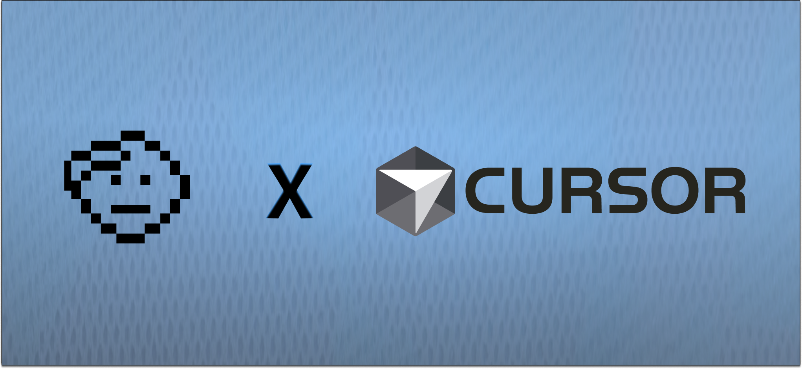

<p align="center">
  
</p>

# Honcho Plugins for Cursor

[](https://opensource.org/licenses/MIT)
[](https://honcho.dev)

A plugin marketplace for [Cursor](https://cursor.com), powered by [Honcho](https://honcho.dev) from Plastic Labs.

Give Cursor persistent memory that survives context wipes, session restarts, and tab closures. Your AI assistant remembers what you're working on, your preferences, and what it was doing -- across all your projects.

## Plugins

| Plugin | Description |
|--------|-------------|
| **[honcho](#honcho-plugin)** | Persistent memory for Cursor sessions |
| **[honcho-dev](#honcho-dev-plugin)** | Skills for building AI apps with the Honcho SDK |

---

## Installation

Add the marketplace to Cursor:

```
/plugin marketplace add plastic-labs/cursor-honcho
```

Then install the plugin(s) you want:

```
/plugin install honcho@honcho
/plugin install honcho-dev@honcho
```

Restart Cursor for the plugins to take effect.

---

# `honcho` Plugin

**Persistent memory for Cursor using [Honcho](https://honcho.dev).**

## Prerequisites

**Bun** is required. Install it with:

```bash
curl -fsSL https://bun.sh/install | bash
```

## Quick Start

### Step 1: Get Your Honcho API Key

1. Go to **[app.honcho.dev](https://app.honcho.dev)**
2. Sign up or log in
3. Copy your API key (starts with `hch-`)

### Step 2: Set Environment Variables

Add to your shell config (`~/.zshrc`, `~/.bashrc`, or `~/.profile`):

```bash
# Required
export HONCHO_API_KEY="hch-your-api-key-here"

# Optional (defaults shown)
export HONCHO_PEER_NAME="$USER"           # Your name/identity
export HONCHO_WORKSPACE="cursor"          # Workspace name
export HONCHO_CURSOR_PEER="cursor"        # How the AI is identified
```

Then reload your shell:

```bash
source ~/.zshrc
```

### Step 3: Install & Restart

```
/plugin marketplace add plastic-labs/cursor-honcho
/plugin install honcho@honcho
```

Restart Cursor. You should see the Honcho pixel art and memory loading on startup.

### Step 4: (Optional) Interview

```
/honcho:interview
```

Cursor will interview you about your preferences to kickstart your profile.

## Features

### Subagent Memory

Cursor's subagent system gets automatic memory capture. When subagents complete work, their results are saved to Honcho. This means delegated research, code analysis, and background tasks all contribute to your persistent memory.

### Deep Reasoning Capture

The `afterAgentThought` hook captures substantial AI reasoning (extended thinking blocks). When the AI does deep analysis, the insights are preserved in Honcho for future sessions.

### Memory Analyst Subagent

A custom `memory-analyst` subagent can perform deep Honcho queries on demand. The main agent can delegate complex memory lookups to it.

### Quick Commands

| Command | Description |
|---------|-------------|
| `/recall [topic]` | Search memory for something specific |
| `/remember [fact]` | Save something to persistent memory |
| `/honcho:interview` | Interview to capture preferences |
| `/honcho:status` | Show memory system status |

### Always-On Memory Rule

An always-applied rule reminds Cursor about its memory capabilities, ensuring it actively uses and updates Honcho throughout every session.

## MCP Tools

| Tool | Description |
|------|-------------|
| `search` | Semantic search across session messages |
| `chat` | Query Honcho's knowledge about the user |
| `create_conclusion` | Save insights about the user to memory |

## Hook Events

| Hook | Purpose |
|------|---------|
| `sessionStart` | Load context from Honcho |
| `sessionEnd` | Upload messages and generate summary |
| `beforeSubmitPrompt` | Save messages, retrieve relevant context |
| `postToolUse` | Log tool activity to Honcho |
| `preCompact` | Anchor memory before context compaction |
| `stop` | Capture meaningful assistant responses |
| `subagentStop` | Save subagent results to memory |
| `afterAgentThought` | Capture deep reasoning |
| `afterAgentResponse` | Save assistant prose responses |

## Environment Variables

| Variable | Required | Default | Description |
|----------|----------|---------|-------------|
| `HONCHO_API_KEY` | **Yes** | -- | Your Honcho API key from [app.honcho.dev](https://app.honcho.dev) |
| `HONCHO_PEER_NAME` | No | `$USER` | Your identity in the memory system |
| `HONCHO_WORKSPACE` | No | `cursor` | Workspace name |
| `HONCHO_CURSOR_PEER` | No | `cursor` | How the AI is identified |
| `HONCHO_ENDPOINT` | No | `production` | `production`, `local`, or a custom URL |
| `HONCHO_ENABLED` | No | `true` | Set to `false` to disable |
| `HONCHO_SAVE_MESSAGES` | No | `true` | Set to `false` to stop saving messages |
| `HONCHO_LOGGING` | No | `true` | Set to `false` to disable file logging |

## Architecture

```
+---------------------------------------------------------------+
|                          Cursor IDE                           |
+---------------------------------------------------------------+
| sessionStart  | beforeSubmit | postToolUse | subagentStop     |
| ------------- | ------------ | ----------- | --------         |
| Load context  | Save message | Log activity| Capture subagent |
| from Honcho   | to Honcho    | to Honcho   | results          |
+---------------------------------------------------------------+
                              |
                              v
+---------------------------------------------------------------+
|                         Honcho API                            |
|                                                               |
|   Messages + reasoning -> Persistent Memory ->                |
|   Retrieved as context at session start                       |
+---------------------------------------------------------------+
```

## Cross-Surface Integration

To share memory with other Honcho-connected tools (e.g. [claude-honcho](https://github.com/plastic-labs/claude-honcho)), set the same workspace on both sides:

```bash
export HONCHO_WORKSPACE="shared"  # Set identically in both tools
```

The AI peers remain separate (`cursor` vs `claude`), so Honcho distinguishes who said what while maintaining a unified model of you.

## Troubleshooting

### "Not configured" or no memory loading

1. Check your API key: `echo $HONCHO_API_KEY`
2. Check the plugin is installed: `/plugin`
3. Restart Cursor after changes

### Memory not persisting

Make sure `HONCHO_SAVE_MESSAGES` is not `false`.

### Using a local Honcho instance

```bash
export HONCHO_ENDPOINT="local"  # Uses localhost:8000
```

### Temporarily disabling

```bash
export HONCHO_ENABLED="false"
```

---

# `honcho-dev` Plugin

**Skills for building AI applications with the Honcho SDK.**

| Command | Description |
|---------|-------------|
| `/honcho-dev:integrate` | Add Honcho to your project |
| `/honcho-dev:migrate-py` | Migrate Python code to latest Honcho SDK |
| `/honcho-dev:migrate-ts` | Migrate TypeScript code to latest Honcho SDK |

```
/plugin install honcho-dev@honcho
```

---

## Uninstalling

```
/plugin uninstall honcho@honcho
/plugin uninstall honcho-dev@honcho
/plugin marketplace remove honcho
```

---

## License

MIT -- see [LICENSE](LICENSE)

---

## Links

- **Issues**: [GitHub Issues](https://github.com/plastic-labs/honcho/issues)
- **Discord**: [Join the Community](https://discord.gg/plasticlabs)
- **X (Twitter)**: [@honchodotdev](https://x.com/honchodotdev)
- **Plastic Labs**: [plasticlabs.ai](https://plasticlabs.ai)
- **Honcho**: [honcho.dev](https://honcho.dev)
- **Documentation**: [docs.honcho.dev](https://docs.honcho.dev)
- **Claude Code version**: [claude-honcho](https://github.com/plastic-labs/claude-honcho)
