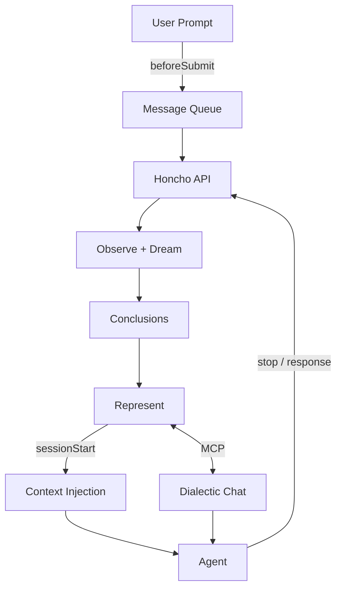
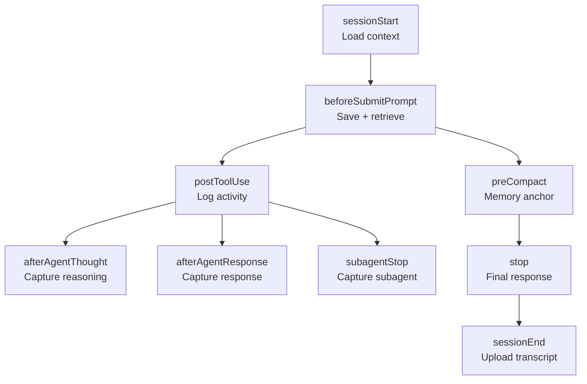

# cursor-honcho: Architecture

> Persistent memory for every Cursor session. Nine hooks intercept the agent lifecycle; Honcho accumulates identity across sessions, projects, and surfaces.

**[plastic-labs/cursor-honcho](https://github.com/plastic-labs/cursor-honcho)** | TypeScript / Cursor Plugin | v0.1.0 | February 2026

---

## Contents

01. [Data Flow & Core Thesis](#data-flow--core-thesis)
02. [Why This Matters](#why-this-matters)
03. [Hook Architecture](#hook-architecture)
04. [Shared Memory](#shared-memory)
05. [Peer Architecture](#peer-architecture)
06. [Cache System](#cache-system)
07. [Context Lifecycle](#context-lifecycle)
08. [MCP Server](#mcp-server)
09. [Cursor-Exclusive Features](#cursor-exclusive-features)
10. [Configuration](#configuration)
11. [File Structure](#file-structure)
12. [Progress](#progress)
13. [Demo: Session Lifecycle](#demo-session-lifecycle)
14. [P.S. -- API Surface](#ps--api-surface)

---

## Data Flow & Core Thesis

Every prompt, tool call, reasoning trace, and response is a signal about what you're building and how you think. The plugin makes that signal legible to Honcho -- and Honcho feeds back consolidated identity at the start of every session, before every prompt, and during context compaction. Everything runs as Bun subprocesses invoked by Cursor's hook system. No daemon, no polling -- the agent lifecycle itself is the trigger.



### Agent --> Honcho

- **Queue** -- every user prompt is appended to a local JSONL queue (~1-3ms) before async upload, ensuring zero message loss even if the API is slow
- **Chunk** -- messages exceeding 24KB are split at newline/space boundaries with `[Part N/M]` prefixes
- **Attribute** -- user messages carry the user peer ID; tool calls, reasoning, and responses carry the cursor peer ID
- **Session** -- deterministic name `{peerName}-{basename(cwd)}`, shared with Claude Code for cross-surface convergence

### Honcho --> Agent

- **Context injection** -- at session start, user context (peer card + representation + conclusions) and cursor context (recent work + self-reflection) are fetched in parallel and injected as `additional_context`
- **Per-prompt context** -- topic-aware semantic search on each prompt, with TTL-based caching to avoid redundant API calls
- **Memory anchor** -- before context compaction, all available Honcho context is injected as a structured document marked `(PRESERVE)`
- **MCP tools** -- on-demand `search`, `chat`, and `create_conclusion` for mid-conversation queries

---

## Why This Matters

Every Cursor session starts from zero. The agent has no memory of your architecture decisions, your preferred patterns, what you were working on yesterday, or what you told it three sessions ago. Context compaction erases everything that doesn't fit in the summary. You repeat yourself. The agent re-discovers what it already knew.

Honcho changes this because it operates on a different timescale. It doesn't summarize and discard -- it derives, consolidates, and builds a persistent representation that evolves as you work. The plugin hooks into nine lifecycle events to capture the full signal of a coding session: what you asked, what the agent built, how it reasoned, what tools it used, what subagents it spawned.

This means:

- **Sessions inherit context.** The agent knows your preferences, your architecture, and your recent work before you say anything. No preamble needed.
- **Understanding compounds.** The 100th session benefits from the 99 before it. Conclusions consolidate through dreaming into an increasingly precise identity.
- **Compaction is lossless.** When Cursor truncates context, the memory anchor preserves everything Honcho knows. The agent loses conversation history but retains identity.
- **Multiple surfaces converge.** The same identity built from Cursor sessions also informs Claude Code, Obsidian, or any other Honcho-connected tool. Code in Cursor; the understanding follows you everywhere.
- **You stay in control.** Everything is opt-in. `HONCHO_ENABLED=false` disables the plugin. `HONCHO_SAVE_MESSAGES=false` stops message upload. No data leaves your machine without an API key.

---

## Hook Architecture

Cursor exposes nine lifecycle hooks. Each fires as a subprocess, receives JSON on stdin, and returns JSON on stdout. The plugin registers a handler for every hook, each as a thin 3-line shim that imports and calls the real handler from `src/hooks/`.



### Hook registry

| Hook | Timeout | Output Format | Purpose |
|------|---------|---------------|---------|
| `sessionStart` | 30s | `{ additional_context, user_message }` | Load identity + work context from Honcho, inject as system context |
| `beforeSubmitPrompt` | 15s | `{ continue, user_message }` | Queue message locally, upload async, retrieve topic-aware context |
| `postToolUse` | 10s | `{}` | Log significant tool activity (Write, Edit, Bash, Task) to Honcho |
| `afterAgentThought` | 10s | -- | Capture substantial reasoning traces (>500 chars, >3s) |
| `afterAgentResponse` | 10s | -- | Capture meaningful assistant responses (>=100 chars) |
| `subagentStop` | 10s | `{}` | Capture completed subagent results and duration |
| `preCompact` | 20s | `{ user_message }` | Inject full Honcho memory anchor before context compaction |
| `stop` | 10s | `{}` | Upload last meaningful assistant response |
| `sessionEnd` | 30s | -- | Upload transcript, flush queue, generate self-summary |

### Input format

Every hook receives a `CursorHookInput` JSON object on stdin containing `conversation_id`, `session_id`, `workspace_roots[]`, and hook-specific fields. The working directory is extracted from `workspace_roots[0]`; the instance ID from `conversation_id`.

### Output conventions

- `additional_context` -- injected as system-level context the agent sees but the user doesn't
- `user_message` -- injected as a user-attributed message in the conversation
- `continue: true` -- required by `beforeSubmitPrompt` to let the prompt proceed
- `{}` -- hooks that observe without modifying (postToolUse, stop, subagentStop) output empty JSON
- `followup_message` -- deliberately avoided in `stop` to prevent auto-loop behavior

> **Tool matcher.** `postToolUse` registers a matcher pattern (`Write|Edit|Shell|Task|MCP`) so it only fires for significant tool calls, skipping reads and searches entirely.

---

## Shared Memory

The plugin shares its Honcho workspace and local cache with [claude-honcho](https://github.com/plastic-labs/claude-honcho) (the Claude Code plugin). Both tools write to the same `claude_code` workspace by default, use the same `~/.honcho/` cache directory, and target the same user peer. Only the AI peer differs.

### Claude Code
- AI peer: `claude`
- Settings: `~/.claude/settings.json`
- Hooks: `hooks/` in settings
- 6 hook events
- Output: `{ result }` wrapper

### Cursor
- AI peer: `cursor`
- Settings: `~/.cursor/hooks.json`
- Hooks: `.cursor-plugin/` manifests
- 9 hook events
- Output: direct JSON

When both plugins are active, the session accumulates messages from both surfaces. Honcho's observation pipeline sees the combined signal -- your Claude Code conversations and your Cursor sessions contribute to the same identity. Conclusions derived from one surface inform context on the other.

> **Convergence by default.** No configuration needed. Both plugins target `claude_code` workspace and share `~/.honcho/cache.json`, `context-cache.json`, `message-queue.jsonl`, and `claude-context.md`. Install both and they converge automatically.

---

## Peer Architecture

Honcho uses an observer/observed model. The **observed** peer is the user whose identity is being built. The **observer** is the AI whose responses and behavior are tracked. Each hook handler resolves both peers at session start and configures observation flags.

| Role | Peer | Flags | What it does |
|------|------|-------|-------------|
| Observed (user) | `$USER` or `HONCHO_PEER_NAME` | `observe_me: true` | The person -- whose identity Honcho builds from prompts and project signals |
| Observer (AI) | `cursor` or `HONCHO_CURSOR_PEER` | `observe_others: true` | The agent -- whose responses, tool use, and reasoning are tracked |

User messages (prompts) are attributed to the user peer. Everything else -- tool activity, reasoning traces, responses, subagent results -- is attributed to the cursor peer. This separation lets Honcho build two distinct context views: what the user cares about, and what the AI has been doing.

Peer configuration is set via fire-and-forget calls during `sessionStart`. Both `honcho.peer()` and `honcho.session()` are idempotent -- calling them with an existing name returns the existing resource.

---

## Cache System

Five cache layers at `~/.honcho/` provide local-first reliability and reduce API calls. Every cache is JSON or JSONL, human-readable, and shared between Claude Code and Cursor.

| Layer | File | Purpose | Eviction |
|-------|------|---------|----------|
| ID Cache | `cache.json` | Workspace name->ID, peer name->ID, session cwd->ID mappings | Manual or `clearAllCaches()` |
| Context Cache | `context-cache.json` | User context, cursor context, summaries with TTL | TTL (default 300s) or message threshold (default 30) |
| Message Queue | `message-queue.jsonl` | Append-only buffer of unsent messages; fields: content, peerId, cwd, timestamp | Marked `uploaded` after successful API call |
| Work Log | `claude-context.md` | Activity log: tool calls, file writes, subagent results, session summaries | Max entries (default 50) |
| Git State | `git-state.json` | Per-cwd: branch, commit, message, dirty files, timestamp | Overwritten per session start |

### Context cache TTL

The context cache uses two eviction strategies: time-based (default 300s) and message-count-based (default 30 messages). Whichever triggers first causes a fresh fetch from Honcho. The message threshold enables knowledge graph refresh -- after enough new messages, the representation may have evolved.

### Message queue reliability

`beforeSubmitPrompt` writes to the local JSONL queue in ~1-3ms, then starts an async upload. If the API is slow or fails, the message is still queued. `sessionEnd` flushes any remaining queued messages, filtered by working directory to avoid cross-project contamination.

---

## Context Lifecycle

Context flows through three distinct phases, each targeting a different moment in the agent's lifecycle.

### Phase 1: Session start

The most expensive phase. Five parallel API calls fetch the full context picture:

1. `userPeer.context()` -- peer card, representation, up to 25 conclusions
2. `cursorPeer.context()` -- cursor's recent work context, up to 15 conclusions
3. `session.summaries()` -- previous session summaries
4. `userPeer.chat()` -- dialectic summary of the user's profile
5. `cursorPeer.chat()` -- dialectic summary of cursor's recent work

Results are assembled into a structured markdown document injected as `additional_context`. Git state is captured and compared to previous session state -- branch switches and new commits are uploaded as user messages. Pixel art is rendered to TTY.

### Phase 2: Per-prompt

`beforeSubmitPrompt` runs on every user message. It extracts topics (file paths, quoted strings, tech terms, error patterns) and checks the context cache. If fresh and below the message threshold, cached context is returned instantly. Otherwise, a topic-aware semantic search fetches fresh context from Honcho. Trivial prompts (yes/no/ok/slash commands) skip context retrieval entirely.

### Phase 3: Pre-compaction

When Cursor is about to truncate context, `preCompact` fires. This is the "last chance" hook -- it fetches everything available from Honcho (with higher limits than session start) and injects a structured **HONCHO MEMORY ANCHOR** with sections marked `(PRESERVE)`. The anchor becomes part of the compaction summary, ensuring identity survives truncation.

> **Lossless compaction.** The memory anchor includes: session identity, user profile (peer card), key conclusions, cursor's recent work, session summaries, and dialectic understanding. Even after aggressive context truncation, the agent retains a complete identity picture.

---

## MCP Server

A Model Context Protocol server exposes three on-demand tools the agent can call mid-conversation. The server runs as a Bun subprocess defined in `.mcp.json`.

| Tool | Input | What it does |
|------|-------|-------------|
| `search` | `query`, `limit?` | Semantic search across session messages. Returns content, peer attribution, timestamps |
| `chat` | `query` | Dialectic reasoning about the user. Grounded in conclusions + representation. Medium reasoning level |
| `create_conclusion` | `content` | Save a key insight or biographical detail. Persists as a conclusion in the session |

The MCP server uses `CURSOR_PROJECT_DIR` (Cursor's env var) to determine the session name. It shares the same config loading and Honcho client initialization as the hooks.

---

## Cursor-Exclusive Features

Cursor's plugin system supports declarative Markdown components that Claude Code doesn't have: custom subagents, slash commands, and always-applied rules. The plugin leverages all three.

### Three exclusive hooks

Cursor exposes three hook events that Claude Code lacks:

- `subagentStop` -- fires when a spawned subagent completes. The handler captures the agent type, duration, and result (truncated to 500 chars), uploading it as a cursor peer message
- `afterAgentThought` -- fires after deep reasoning. Only captures substantial traces (>500 chars AND >3 seconds), filtering out trivial internal reasoning
- `afterAgentResponse` -- fires after the agent produces a response. Filters for meaningful content (>=100 chars, not tool announcements)

### Memory analyst subagent

A read-only subagent (`agents/memory-analyst.md`) specialized in deep Honcho queries. Uses the `fast` model. Given a complex question about user history or preferences, it breaks it into 2-3 sub-queries, combines results from `search` and `chat` MCP tools, and reports with confidence levels and evidence gaps.

### Slash commands

| Command | MCP Tool | Purpose |
|---------|----------|---------|
| `/recall [topic]` | `search` | Quick memory search -- find past interactions by topic, summarize with timestamps and session context |
| `/remember [fact]` | `create_conclusion` | Save to memory -- persist an insight or preference as a Honcho conclusion |

### Always-on memory rule

`rules/honcho-memory.md` is applied to every conversation. It instructs the agent to: trust injected Honcho context, use MCP tools for deeper queries mid-conversation, save new insights via `create_conclusion`, check memory before asking preference questions, and delegate complex memory queries to the `memory-analyst` subagent.

---

## Configuration

### Environment variables

| Variable | Required | Default | Description |
|----------|----------|---------|-------------|
| `HONCHO_API_KEY` | Yes | -- | Honcho API key |
| `HONCHO_PEER_NAME` | No | `$USER` | User peer name (the observed identity) |
| `HONCHO_WORKSPACE` | No | `claude_code` | Workspace name (shared with Claude Code) |
| `HONCHO_CURSOR_PEER` | No | `cursor` | AI peer name. Fallback: `HONCHO_CLAUDE_PEER` |
| `HONCHO_ENDPOINT` | No | production | `local` for localhost:8000, or a full URL |
| `HONCHO_SAVE_MESSAGES` | No | `true` | Upload messages to Honcho. `false` disables |
| `HONCHO_ENABLED` | No | `true` | Master kill switch. `false` disables all hooks |
| `HONCHO_LOGGING` | No | `true` | Structured activity logging |

### Config file

`~/.honcho/config.json` persists settings across sessions. Environment variables override file values. The file is created by `saveConfig()` and read by `loadConfig()`, which merges file + env.

### Tuning parameters

| Parameter | Default | Description |
|-----------|---------|-------------|
| `contextRefresh.ttlSeconds` | `300` | Context cache lifetime before forced refresh |
| `contextRefresh.messageThreshold` | `30` | Messages before knowledge graph refresh |
| `contextRefresh.skipDialectic` | `false` | Skip dialectic chat calls (faster but less nuanced) |
| `localContext.maxEntries` | `50` | Max entries in `claude-context.md` work log |
| `messageUpload.summarizeAssistant` | `false` | Summarize assistant messages before upload |

### API endpoints

| Environment | Base URL |
|-------------|----------|
| Production | `https://api.honcho.dev/v3` |
| Local | `http://localhost:8000/v3` |

---

## File Structure

```
plugins/honcho/
├── .cursor-plugin/
│   └── plugin.json            # Plugin manifest: skills, agents, commands, rules paths
├── .mcp.json                  # MCP server config (bun run mcp-server.ts)
├── mcp-server.ts              # 5-line entrypoint
├── hooks/
│   ├── hooks.json             # 9 hook event registrations with timeouts + matchers
│   ├── session-start.ts       # Shim -> src/hooks/session-start.ts
│   ├── session-end.ts         # Shim -> src/hooks/session-end.ts
│   ├── before-submit-prompt.ts
│   ├── post-tool-use.ts
│   ├── pre-compact.ts
│   ├── stop.ts
│   ├── subagent-stop.ts
│   ├── after-agent-thought.ts
│   └── after-agent-response.ts
├── src/
│   ├── config.ts              # HonchoCursorConfig, env var loading, session naming
│   ├── cache.ts               # 5 cache layers, message queue, git state, chunking
│   ├── git.ts                 # Git state capture, change detection, feature inference
│   ├── log.ts                 # Structured logging (hook, api, cache, flow, async, error)
│   ├── visual.ts              # Stderr output for TTY, verbose file logging
│   ├── install.ts             # Checks ~/.cursor/hooks.json for installation
│   ├── pixel.ts               # Honcho pixel art character
│   ├── spinner.ts             # Animated spinners (wave, neural, braille, moon)
│   ├── styles.ts              # ANSI colors: orange-to-pale-blue gradient
│   ├── unicode.ts             # Runtime Unicode generation (blocks, circles, arrows, box)
│   ├── hooks/
│   │   ├── session-start.ts   # 330 lines -- parallel context fetch, git state, pixel art
│   │   ├── session-end.ts     # 351 lines -- transcript parse, upload, self-summary
│   │   ├── before-submit-prompt.ts # 296 lines -- topic extraction, TTL cache
│   │   ├── post-tool-use.ts   # 270 lines -- semantic tool analysis, rich summaries
│   │   ├── pre-compact.ts     # 242 lines -- memory anchor with (PRESERVE) sections
│   │   ├── stop.ts            # 175 lines -- last response capture
│   │   ├── subagent-stop.ts   # 89 lines -- subagent result capture
│   │   ├── after-agent-thought.ts # 73 lines -- reasoning trace capture
│   │   └── after-agent-response.ts # 80 lines -- response capture
│   ├── mcp/
│   │   └── server.ts          # 3 tools: search, chat, create_conclusion
│   └── skills/
│       └── status-runner.ts   # CLI status display
├── skills/
│   ├── interview/SKILL.md     # 8-question user interview
│   └── status/SKILL.md        # Memory system status display
├── agents/
│   └── memory-analyst.md      # Read-only deep query subagent
├── commands/
│   ├── recall.md              # /recall -- quick memory search
│   └── remember.md            # /remember -- save to memory
└── rules/
    └── honcho-memory.md       # Always-applied memory behavior rule

plugins/honcho-dev/
├── .cursor-plugin/plugin.json
└── skills/
    ├── integrate/SKILL.md     # Honcho SDK integration guide
    ├── migrate-py/SKILL.md    # Python SDK v1.6 -> v2.0 migration
    └── migrate-ts/SKILL.md    # TypeScript SDK v1.6 -> v2.0 migration
```

---

## Progress

- [x] Config system: env vars, file persistence, Cursor-specific peer naming
- [x] 5-layer cache: ID, context (TTL), message queue (JSONL), work log, git state
- [x] Session start: parallel 5-source context fetch, git state capture, pixel art
- [x] Before submit: topic extraction, TTL-based caching, async upload, skip patterns
- [x] Post tool use: semantic tool analysis, rich summaries for Write/Edit/Bash/Task
- [x] Pre-compact: full memory anchor with (PRESERVE) sections
- [x] Stop: last response capture without auto-loop
- [x] Session end: transcript parsing, queue flush, assistant message extraction, self-summary
- [x] 3 Cursor-exclusive hooks: subagentStop, afterAgentThought, afterAgentResponse
- [x] MCP server: search, chat, create_conclusion tools
- [x] Memory analyst subagent
- [x] /recall and /remember slash commands
- [x] Always-on memory rule
- [x] Shared memory with Claude Code (same workspace, cache directory, user peer)
- [x] Interview and status skills
- [x] honcho-dev plugin: integrate, migrate-py, migrate-ts skills
- [ ] Integration testing against live Cursor sessions
- [ ] Marketplace publication
- [ ] Visual status indicator in Cursor UI

---

## Demo: Session Lifecycle

End-to-end walkthrough of a single Cursor session with Honcho active.

### 1. Session starts

`sessionStart` fires. The handler captures git state (`main @ a3912b1`, clean), resolves the session (`eri-cursor-honcho`), and launches 5 parallel API calls. Within the 30s timeout, it injects:

```
## Honcho Memory System Active
- User: eri
- AI: cursor
- Workspace: claude_code
- Session: cursor-honcho

## eri's Profile
Unified quality-assurance personality...

## AI Self-Reflection
Recent activities focused on building the cursor-honcho plugin...

## Session Summary
Eri requested creation of a Cursor plugin named "honcho"...
```

### 2. User sends a prompt

`beforeSubmitPrompt` receives: *"can you add error handling to the cache layer?"*

1. Message queued to `~/.honcho/message-queue.jsonl` (~2ms)
2. Async upload starts immediately
3. Topics extracted: `["error", "handling", "cache", "layer"]`
4. Context cache is stale (TTL expired) -- fresh fetch with search query `"error handling cache layer"`
5. Results injected as `user_message` with relevant conclusions

### 3. Agent works

`postToolUse` fires for each significant tool call:

```
# Write to cache.ts detected:
[Tool] Wrote cache.ts (defines handleCacheError, 45 lines)

# Edit to config.ts detected:
[Tool] Edited config.ts (+12/-3 tokens, line 156)

# Subagent spawned and completed:
[Subagent general-purpose](4.2s) Found 3 error patterns in existing code
```

### 4. Context fills up

`preCompact` fires at 85% context usage. It fetches all available context from Honcho and injects a memory anchor:

```
# === HONCHO MEMORY ANCHOR (PRESERVE) ===

## Session Identity (PRESERVE)
User: eri | AI: cursor | Session: cursor-honcho

## User's Profile (PRESERVE)
Pragmatic perfectionism with unified quality-assurance...

## Key Conclusions About User (PRESERVE)
- Treats precision failures as system validation signals
- Applies essentialism recursively across all domains

## Cursor's Recent Work (PRESERVE)
Added error handling to cache.ts, modified config.ts...
```

### 5. Session ends

`sessionEnd` parses the transcript JSONL, extracts up to 40 assistant messages (prioritizing explanatory content over tool announcements), uploads them with cursor peer attribution, generates a self-summary, and writes it to `claude-context.md`.

---

## P.S. -- API Surface

### Currently used

| Capability | Used by |
|-----------|---------|
| `honcho.session(name)` | Every hook -- session resolution by name |
| `honcho.peer(name)` | Every hook -- user peer + cursor peer resolution |
| `session.setPeerConfiguration()` | sessionStart -- observation flags |
| `peer.context()` | sessionStart, preCompact -- card + representation + conclusions |
| `session.context()` | beforeSubmitPrompt -- topic-aware semantic search |
| `peer.chat()` | sessionStart, preCompact -- dialectic summary |
| `session.addMessages()` | sessionEnd, stop, subagentStop, afterAgent* -- message upload |
| `session.summaries()` | sessionStart, preCompact -- previous session summaries |
| `session.search()` | MCP search tool -- semantic search across messages |
| `peer.conclusions.create()` | MCP create_conclusion tool -- save insights |

### Proposals

The hook-to-identity pipeline works through conversational primitives. These would make it native.

| Proposal | Why |
|----------|-----|
| Bulk message ingestion endpoint | Session end uploads 40+ messages in serial `addMessages` calls. One batch endpoint would cut latency by 10x |
| Streaming context SSE | Context injection at session start could stream incrementally instead of blocking on 5 parallel calls |
| Cross-session conclusion dedup | Cursor and Claude Code sessions may derive duplicate conclusions from overlapping signals |
| Lightweight context ping | A fast "has anything changed?" check would let beforeSubmitPrompt skip fetches when the representation hasn't evolved |
